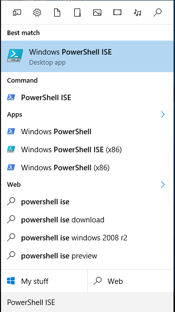
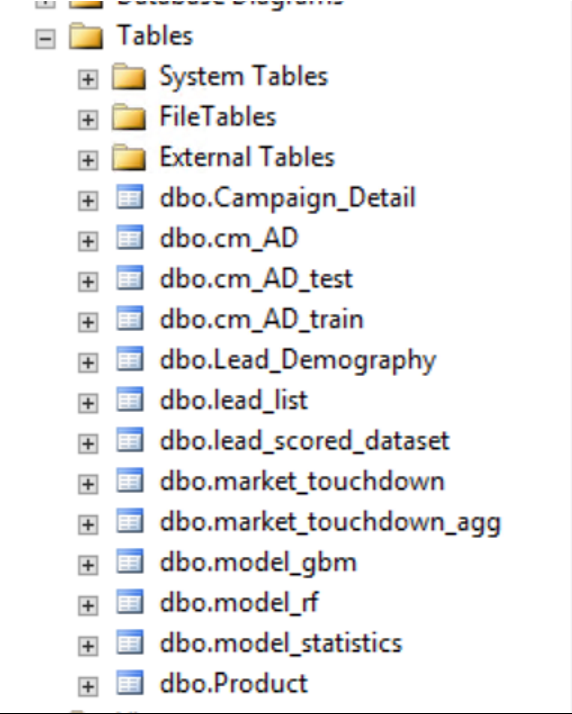

<h1>Campaign Management:
Execution with PowerShell</h1>

For the purposes of a quick demo, we can use a small dataset. To create a smaller dataset follow the steps in <a href="Data_Setup.md">Data Setup</a>.

Make sure you have set up your SQL Server and ODBC connection between SQL and PowerBI by following the instructions in <a href="START_HERE.md">START HERE</a>.  Then proceed with the steps below to run the solution template using the automated PowerShell files. 

Running these PowerShell scripts performs the automated version of the solution – dataset creation, modeling, and scoring as described  <a href="../data-scientist.md">here</a>.

<h2>Solution Path:  PowerShell Scripts</h2>
1.	Click on the windows key on your keyboard. Type the words `PowerShell ISE` and open the Windows PowerShell ISE app.
 

2.	In the Powershell ISE command window, type the following command:

<pre><code>
Set-ExecutionPolicy Unrestricted -Scope Process
</code></pre>
Answer <code>y</code> to the prompt to allow the following scripts to execute.

<h2>Analytical Dataset Creation</h2>
This section simulates input data and performs preprocessing and feature engineering to create the analytical dataset.  

3.	Click on File on the top left corner of the screen. Then click on Open and navigate to the folder location where you unzipped the CampaignManagement.zip file and open `Analytical Dataset Creation.ps1`

4.	Press `F5` to run the PowerShell script.

You will get a warning here saying that you should only run scripts you trust.
5.	Hit `Run Once`.

The command line window will prompt you to enter the Server Name.
6.	Enter your Machine Name. If you do not know your Machine Name follow instructions from the [START HERE](START_HERE.md).
The command line window will prompt you to enter the Database Name.
7.	Enter `CampaignManagement`.

The command line window will prompt you to enter the Schema Name.
8.	Enter `dbo`.

The command line window will prompt you to enter your Username and Password. Refer to the [START HERE](START_HERE.md) instructions.

9.	Enter Your UserName & Password that you created earlier using the [START HERE](START_HERE.md) Instructions.

The command line window will ask you if you want to simulate the data or if you want to import data from existing .csv files
10.	Enter `S`. This will simulate the data.

The command line window will prompt you to enter the Full Path of the Data Location.

11.	Enter the full path of the folder you extracted the CampaignManagement.zip file (`C:\Demos\CampaignManagement`).

You can see that the Input dataset simulation has started. This process might take a few minutes. 
 

 
Once complete, you may also view the tables that were created in SQL Server. 
 Switch to SSMS and select the CampaignManagement database, right click and select `Refresh`.  Then open the Tables section to view the tables in the Analytical Dataset which were just created:
  

You may also view contents of any of these tables.  Right click on a table and select `View Top 1000 Rows` to preview a table.
 

Once the Analytical Dataset is created, move on to the next step.

<h2>Model Development</h2>
Next, two models are trained and tested.

12.	Click on File on the top left corner of the screen. Then click on Open and navigate to the folder location where you unzipped the CampaignManagement.zip file and open `Model Development.ps1`.

13.	Press F5 to run the PowerShell script.

You will get a warning here saying that you should only run scripts you trust.
14.	Hit `Run Once`.

The command line window will prompt you to enter the Server Name.

15.	Enter your Machine Name. If you do not know your Machine Name follow instructions from [START HERE](START_HERE.md).

The command line window will prompt you to enter the Database Name.

16.	Enter `CampaignManagement`.

The command line window will prompt you to enter the Schema Name.

17.	Enter `dbo`.

The command line window will prompt you to enter your Username and Password. Refer to the [START HERE](START_HERE.md) Instructions.

18.	Enter Your UserName & Password that you created earlier using the [START HERE](START_HERE.md) Instructions.

The command line window will ask you if you want to continue with Model Deployment, which will replace any prior models.
19.	Answer `y` to continue.

20.	Enter the full path of the folder you extracted the CampaignManagement.zip file (`C:\Demos\CampaignManagement`).

You can see that the Model Training has begun. Once you see the Model AUC’s and Accuracy you can move on to the next step.
 

<h2>Scoring</h2>
The models are now compared and the champion model is used for scoring. The prediction results from the scoring step are the recommendations for contact for new campaigns - when and how to contact each lead for the optimal predicted response rate.
21.	Click on File on the top left corner of the screen. Then click on Open and navigate to the folder location where you unzipped the CampaignManagement.zip file and open `Scoring.ps1`.
22.	Press `F5` to run the PowerShell script.

You will get a warning here saying that you should only run scripts you trust.
23.	Hit `Run Once`.
The command line window will prompt you to enter the Server Name.

24.	Enter your Machine Name. If you do not know your Machine Name follow instructions from  [START HERE](START_HERE.md).

The command line window will prompt you to enter the Database Name.

25.	Enter `CampaignManagement`.

The command line window will prompt you to enter the Schema Name.

26.	Enter `dbo`.

The command line window will prompt you to enter your Username and Password. Refer the instructions from the [START HERE](START_HERE.md).

27.	Enter Your UserName & Password that you created earlier using the [START HERE](START_HERE.md) Instructions.

The command line window will ask you if you want to continue with Scoring, which will replace any prior scored data.

28.	Answer `y` to continue.
29.	 Enter the full path of the folder you extracted the CampaignManagement.zip file (`C:\Demos\CampaignManagement`).

You can see that the scoring has begun.
 

Once the PowerShell scripts have run, log into the SQL Server to view all the datasets that have been created in the `CampaignManagement` database.  
Hit `Refresh` if necessary.
 

Right click on `dbo.lead_scored_dataset` and select `View Top 1000 Rows` to preview the scored data.

<h2>Visualizing Results </h2>
30.	Now proceed to <a href="Visualize_Results.md">Visualizing Results with PowerBI</a>.

