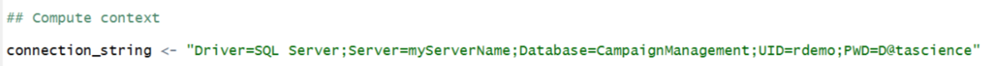

<h1>Campaign Management:
Execution with R Scripts</h1>

For the purposes of a quick demo, we can use a small dataset. To create a smaller dataset follow the steps in <a href="Data_Setup.md">Data Setup</a>.

Make sure you have set up your SQL Server and ODBC connection between SQL and PowerBI by following the instructions in <a href="START_HERE.md">START HERE</a>.  Then proceed with the steps below to run the solution template using the R script files. 

These files represent the files created by the data scientist, who would  typically work from their own machine and push the R compute to a SQL Server. The user of this solution package can choose to deploy Microsoft R Client on their machine and push the compute to the SQL Server, or deploy R Client on the same machine as SQL Server.  (Note the latter would not be typical in a real enterprise setting).


Running these scripts will walk through the initial R code used to create this solution – dataset creation, modeling, and scoring as described [here](../data-scientist.md).

The R code shown here was then incorporated into the [.sql files](../../SQLR/readme.md) to operationalize the solution.


<h2>Solution with R Server</h2>

1.  You will need  [R Client](https://msdn.microsoft.com/en-us/microsoft-r/install-r-client-windows) to execute these R scripts.  You will also want to [install and configure an R IDE](https://msdn.microsoft.com/en-us/microsoft-r/r-client-get-started#configure-ide) to use with R Client.  

2.  Install packages needed for these scripts.  Execute the following code in R:
 ```
 install.packages("data.table")
 install.packages("ROCR")
 q()
 n
 ```

3.  Open the four files in the R directory into your IDE configured with R Client.

4.	Replace the connection string at the top of each file with details of your login and database name in each of the four files.  For example:
 <br/>
 
 
 Note: You can use “.” for the server name as shown here if using a local SQL Server (on the same machine as your code). 

5.	The scripts perform the following actions:

    a.	**step1_input_data.R**:  Simulates the 4 input datasets

    b.	**step2_data_preprocessing.R**: Performs preprocessing steps like outlier treatment and missing value treatment on the input datasets

    c.	**step3_feature_engineering_AD_creation.R**:  Performs Feature Engineering and creates the Analytical Dataset.   Feature Engineering consists of creating new variables in the market touchdown dataset by aggregating the data in multiple levels.  The table is aggregated at a lead level, so variables like channel which will have more than one value for each user are pivoted and aggregated to variables like SMS count, Email count, Call Count, Last Communication Channel, Second Last Communication Channel etc.

    After running this script, take a look at the features created by running the following query in SSMS:
    
    ```
    SELECT TOP 1000 [Lead_Id]
        ,[Sms_Count]
        ,[Email_Count]
        ,[Call_Count]
        ,[Last_Channel]
        ,[Second_Last_Channel]
    FROM [CampaignManagement].[dbo].[market_touchdown_agg]
    ```

    d.	**step4_model_rf_gbm.R**:  Builds the Random Forest & Gradient Boosting models, identifies the champion model and scores the Analytical dataset

6.	Run each script in order.  Note some may take some time to finish.  You’ll know they are done when you put cursor in the Console area (labeled “R Interactive” in RTVS)  and it is no longer spinning.  Also when done you’ll see the command prompt “>” ready for the next interactive command. 
<br/>

 

7.	After each step completes, feel free to go back to SSMS and look at the contents of the database.  You’ll need to right click on Database and `Refresh` to see the most recent set of results.
 <br/>
 

8.	When you have finished with all four scripts, log into the SQL Server to view all the datasets that have been created in the `CampaignManagement` database.  Hit `Refresh` if necessary.
 <br/>
 

 Right click on `dbo.lead_scored_dataset` and select `View Top 1000 Rows` to preview the scored data.
 
<h2>Visualizing Results </h2>
Now proceed to <a href="Visualize_Results.md">Visualizing Results with PowerBI</a>.
