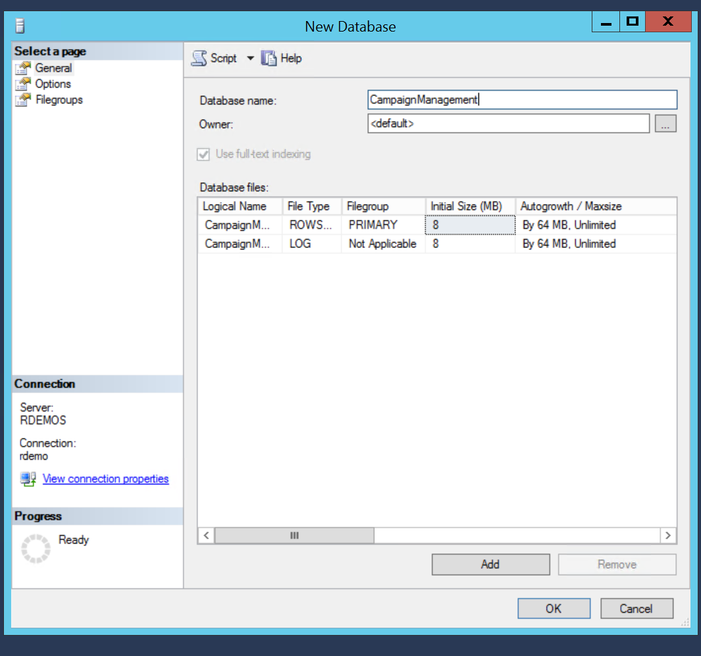
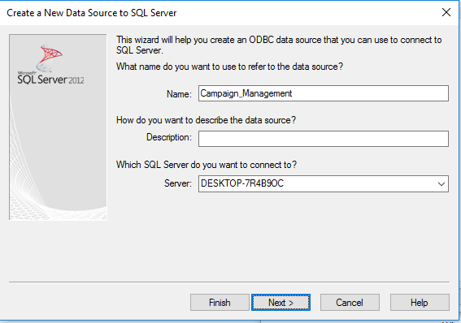
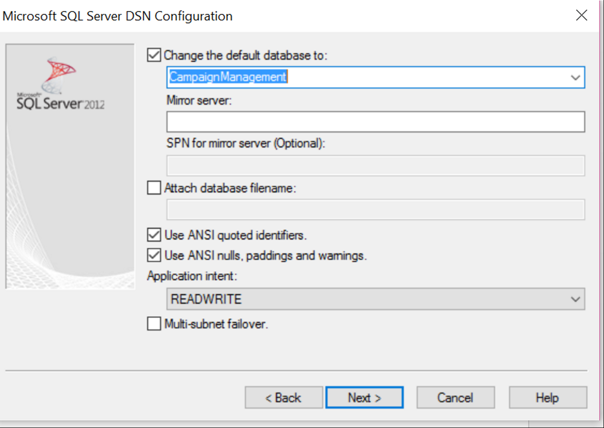
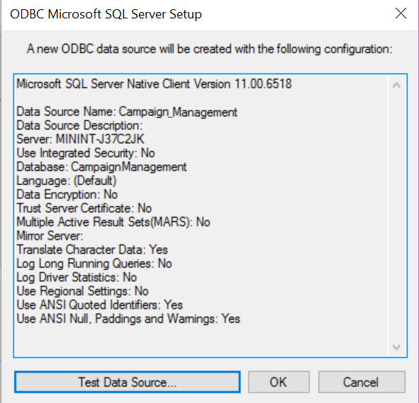
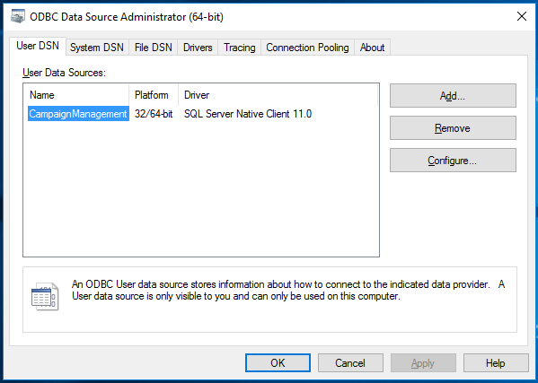

<h1>Campaign Management:
START HERE: Setup </h1>

<h2>Prepare your SQL Server 2016 Installation</h2>
Complete the steps in the Set up SQL Server R Services (In-Database) Instructions. The set up instructions file can found at  <a href="https://msdn.microsoft.com/en-us/library/mt696069.aspx" target="_blank"> https://msdn.microsoft.com/en-us/library/mt696069.aspx</a>

<h2>Set up logins in SQL Server</h2>
<ol>
<li>	In SSMS, connect to the Server with your admin account</li>.
<li>	Create a new user: Right click on <code>Security</code> and select <code>New &gt; Login</code>  
 

</li>
 
<li>	If you haven’t already done so, create a new Windows authentication user with the Login name <code>&lt;machinename&gt;/SQLRUserGroup</code>.

To find your computer name - Click the <code>Start</code> button, right-click <code>Computer</code>, and then click 
<code>Properties</code>. Under Computer name, domain, and workgroup settings, you can find your computer name and full computer name if your computer is on a domain.
 

</li>
 

(It is mandatory to use the Trusted Connection method of accessing the database in an R connection string.)

<li>	Create the "rdemo" user  by opening the <code>Resources/createuser.sql</code> file and executing it.
 (This user login will be used to install data and procedures via the PowerShell script in a later step in this setup).
 

<li>	In the Object Explorer, select this new user and double click or right click and select `Properties`.  (If you don’t see the new user, right click on <code>Logins</code> and select <code>Refresh</code> first.)
 

    </li>
</li>
 
<li>	On the Server Roles tab check <code>public</code> and <code>sysadmin</code>.
 
 
</li>

<li>	
On the User Mapping tab, check  <code>master</code> in the top section, then check  <code>db_datareader</code>, 
 <code>db_datawriter </code>,  <code>db_owner</code>, and  <code>public</code> in the bottom table.  
 

<li>Click <code>OK</code> to close the dialog.
</li>

 
<li>	Check to make sure you have set your Server Authentication mode to SQL Server and Windows Authentication mode.  
    <ul>
<li>	In SQL Server Management Studio Object Explorer, right-click the server, and then click <code>Properties</code>.</li>
<li>	On the Security page, under Server authentication, select <code>SQL Server and Windows Authentication mode</code> if it is not already selected.</li>
  

<li>	In the SQL Server Management Studio dialog box, click OK.  If you changed the mode in the previous step, you will need to also acknowledge the requirement to restart SQL Server.</li>
<li>	If you changed the mode, restart the server.  In the Object Explorer, right-click your server, and then click <code>Restart</code>. If SQL Server Agent is running, it must also be restarted.</li>
</ul></li>

<li>	Now, click on `File` on the top left corner of the SQL Server window and select <code>Connect Object Explorer…</code> verify that you can connect to the server with this username(<code>rdemo</code>) &amp; password(<<code>D@tascience</code>).</li>
</ol>

 

<h3>Install  Packages on SQL Server</h3>

	Install the <code>data.table</code> and <code>ROCR</code>  packages into SQL R: 

<ol>
<li>	On the machine with your server, open a command window  as “Administrator” and submit the following commands:
<pre><code>
cd "C:\Program Files\Microsoft SQL Server\MSSQL13.MSSQLSERVER\R_SERVICES\bin"
R
</code></pre>
</li>
<li>	Once you see the R prompt, execute the following commands:
<pre><code>
install.packages("data.table")
install.packages("ROCR")
q()
n
</code></pre>
</li>
</ol>

<h3>Create Database</h3>
In SSMS, create the “CampaignManagement” Database to be used for this solution. 
<ol>
<li>
Right click on Database and select <code>New Database...</code> 
 

</li>
<li>Type 
<code>CampaignManagement</code> for the name and hit <code>OK</code>.
 

</li>
</ol>

<h3>Set up Connection between SQL Server and PowerBI</h3>
<ol>
<li>	Push the <code>Windows</code> key on your keyboard</li>
<li>	Type <code>ODBC</code> </li>
<li>	Open the correct app depending on what type of computer you are using (64 bit or 32 bit). To find out if your computer is running 32-bit or 64-bit Windows, do the following:</li>
<ol><li>	Open System by clicking the <code>Start</code> button, clicking <code>Control Panel</code>, clicking <code>System and Maintenance</code>, and then clicking <code>System</code>.
<li>.	Under System, you can view the system type</li></ol></li>
<li>	Click on <code>Add</code>
   

</li>
<li>	Select <code>Server Native Client 11.0</code> and click finish
    

 </li>
<li>	Under Name, Enter <code>CampaignManagement</code>. Under Server enter the MachineName from the SQL Server logins set up section. Press <code>Next</code>.
    

</li>
<li>	Select <code>SQL Server authentication</code> and enter the credentials you created in the SQL Server set up section. Press <code>Next</code>
    

</li>
 

<li>	Check the box for <code>Change the default database to</code> and enter <code>CampaignManagement</code>. Press 
<code>Next</code>.
    

</li>
<li>Press <code>Finish</code>
   
 
</li>
<li>Press <code>Test Data Source</code>
   

</li> 
<li>	Press <code>OK</code> in the new popover. This will close the popover and return to the previous popovers.
    

</li>
<li>	Now that the Data Source is tested. Press <code>OK</code>
    

</li>
<li>	Finally, click <code>OK</code> and close the window 
    

</li>
</ol>
<h2>Ready to Run Code</h2>
You are now ready to run the code for this solution.

Typically a data scientist will create and test a predictive model from their favorite R IDE, at which point the models will be stored in SQL Server and then scored in production using Transact-SQL (T-SQL) stored procedures. 

If you’re just interested in the outcomes of this process we have created a fully automated solution that simulates the data, trains and scores the models by executing PowerShell scripts. This is the fastest way to deploy. See [PowerShell Instructions](Powershell_Instructions.md) for this deployment.

Alternatively, if you wish to step-through the process from the perspective of a data scientist using your R IDE, see the [R Instructions](R_Instructions.md).

Finally, we have also prepared a version that steps through the process using T-SQL commands. To do so, follow the [SQLR Instructions](SQLR_Instructions.md).
	