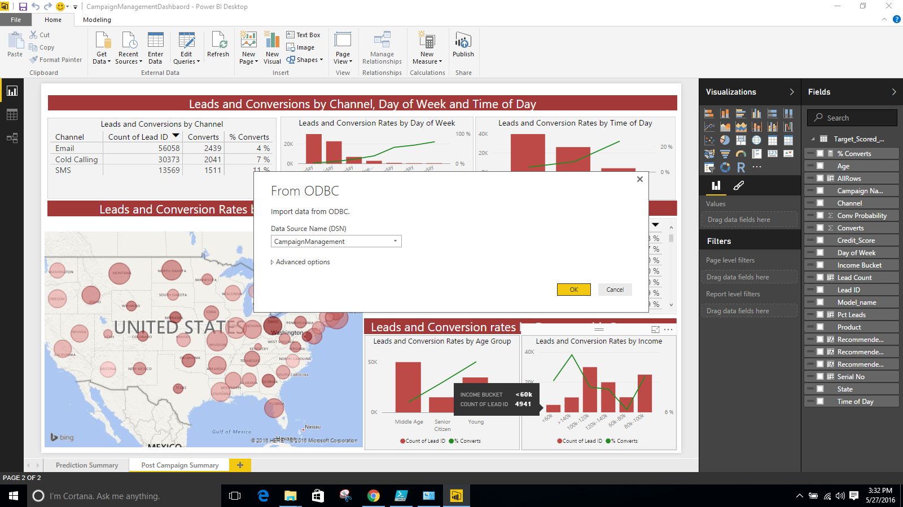
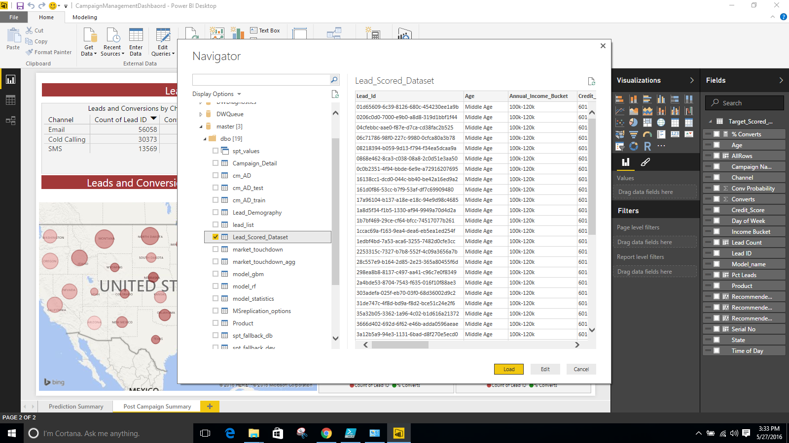
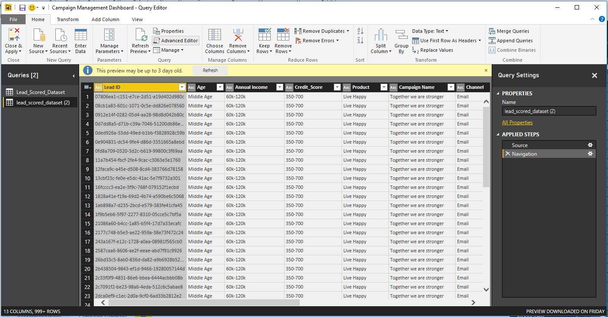
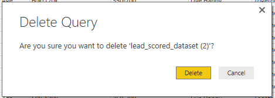

<h1>Campaign Management:
Visualizing Results with PowerBI
</h1>

Steps 1-9 only need to be performed once, across all solution paths (running from R, from SQLR, or Powershell scripts). After you’ve performed this once, you can simply <a href="#step10">
skip to step 10</a> to see new results after any new model scoring.   

1.	Open the CampaignManagementDashboard.pbix file in the Campaign Management folder and click on Get Data and select ‘More...’
The PowerBI dashboard will show charts built from cached data. We need to set it up to use the latest available scored dataset in the SQL Server.
  
 

2.	Select ‘Get Data’ then ‘Other’ and then select ‘ODBC’ and Click ‘Ok’
  
 

3.	Under Data Source Name Enter ‘CampaignManagement’ and click ‘Ok’
  
 

4.	Navigate to CampaignManagement >  dbo and check Lead Scored Dataset. Click ‘Load’
  
 

5.	Once the data is loaded. Click on ‘Edit Queries’. You will see this new window
  
 

  Notice that on the left hand side you have 2 datasets. 

6.	Click on the second dataset and then click on ‘Advanced Editor’. Copy the code in side this
  
 

7.	Next, click on the first dataset and then click on ‘Advanced Editor’. Delete the code here and paste what you had copied earlier
  
 

8.	Next, click on the second dataset and press the delete key on your keyboard. You will see a pop up asking if you want to delete it. Click on `delete`.
  
 

9.	Next, click on `Close and Apply`. This will refresh the backend data on the PowerBI and connect it to the SQL Server
  
 

10.	Press Refresh. This should refresh the back end data of the dashboard and refresh the visuals.  You are now viewing data from your SQL Database, rather than the imported data that was part of the initial solution package.  Updates from the SQL Database will be reflected each time you hit “Refresh” 
  
 

The visuals in the dashboard might not make much sense if you built the model on 10,000 leads. Re-do the entire process but this time keep the number of leads at 100,000 or 1,000,000. Also change the nTree values back to 500. (Find these settings in Data Setup.docx.)  This will build a better model and in-turn a better dashboard.

